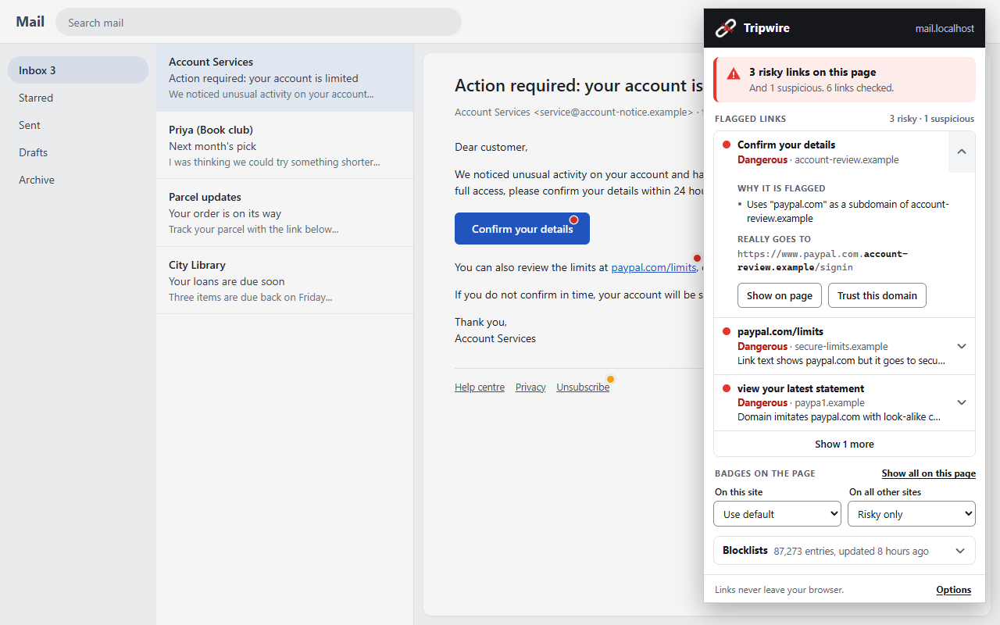
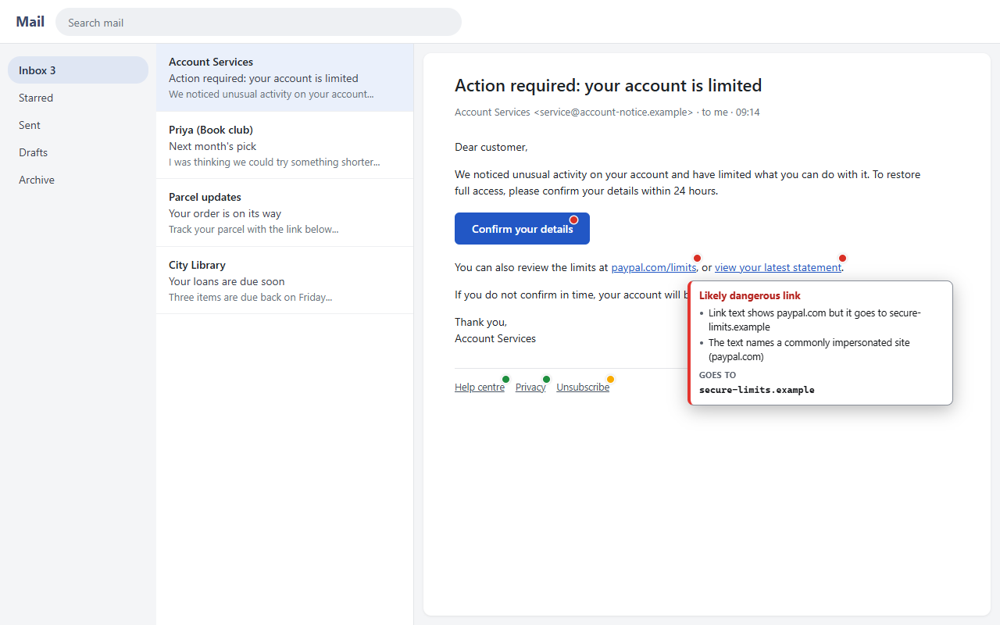
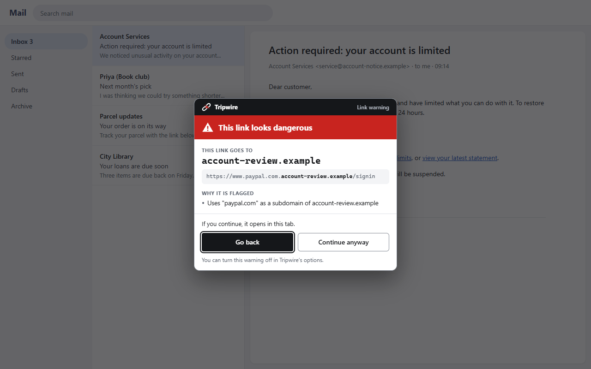

# Tripwire: the details

Everything about Tripwire that doesn't fit on the [front page](../README.md): how it decides, what each part of it does, the full list of limitations, how to work on it, and its history.

Tripwire is a Chrome extension that checks every link on the pages you visit and marks the risky ones with a small coloured badge, so you can spot a bad link before you click it. A link it judges dangerous shows a warning before it opens. It looks for lookalike domains, link text that names one site while the link goes to another, disguised addresses and known phishing and malware sites, and every check runs on your device: the links you see never leave your browser.



> **Status:** version 1.0.0. Free, open source ([MIT](../LICENSE)), no account, no tracking.

## Install

Tripwire is not in the Chrome Web Store yet. Install it from a release:

1. Open the [Releases page](../../../releases) and, under **Assets** of the latest release, download `tripwire-<version>.zip`.
   Don't use **Code** > **Download ZIP** at the top of the repository: that is the source code, with the tests, the demo page and a made-up test blocklist in it.
2. Unzip it into a folder you will keep, for example `Documents/Tripwire`. Chrome runs the extension from that folder, so don't move or delete it afterwards.
3. Open `chrome://extensions` in Chrome (or another Chromium browser, version 114 or newer).
4. Turn on **Developer mode** (the switch at the top right).
5. Click **Load unpacked** and choose the folder you unzipped: the one that contains `manifest.json`.
6. Pin Tripwire to the toolbar (the puzzle-piece icon, then the pin) so its count is visible.
7. Reload any pages that were already open. Tripwire starts on pages opened from now on.

Chrome may show a reminder that developer-mode extensions are turned on. That is expected for any extension not installed from the Web Store.

### Updating

There are no automatic updates yet: Chrome only updates extensions that come from the Web Store. To move to a new version:

1. Download the new release's zip from the [Releases page](../../../releases).
2. Delete everything inside your Tripwire folder, and unzip the new release into that same folder.
3. In `chrome://extensions`, click the reload icon on Tripwire's card, then reload your open pages.

Use the same folder every time. Chrome tells unpacked extensions apart by their folder, so a release loaded from a different folder counts as a new install: your settings and trusted domains would not carry over, and the welcome page would open again.

To hear about new versions, choose **Watch** > **Custom** > **Releases** on the repository.

To run Tripwire from the source code instead, see [Development](#development).

## Features

- A coloured badge on risky links, with a tooltip that gives the reasons and the link's real destination.
- A [warning before a dangerous link opens](#click-time-warning), with "Go back" and "Continue anyway".
- A [popup](#toolbar-icon-and-popup) that says in one sentence how the page looks, lists its flagged links with every reason, and has the display settings.
- [Trusted domains](#trusted-domains): tell Tripwire you know a site, without ever hiding a blocklist match.
- Two downloaded [blocklists](#blocklists), checked on your device.
- [Display modes](#display-modes) per site and overall, and an [options page](#options).
- Works with the keyboard and with [screen readers](#screen-readers), in light and dark, at WCAG AA contrast.
- [No link ever leaves your browser](#privacy).

## Privacy

**The links on the pages you visit never leave your browser.** Tripwire has no server, and there is no online lookup. The full privacy policy is in [PRIVACY.md](../PRIVACY.md).

What Tripwire downloads:

- the two [blocklists](#blocklists), as plain text files, from `malware-filter.gitlab.io`, or from `curbengh.github.io` or `malware-filter.pages.dev` if the first can't be reached. That is every network request Tripwire makes.

What those servers can see: that your IP address fetched a public list file, as with any download. The requests carry no cookies and no information about you, the pages you visit or the links on them.

What stays on your device:

- the lists themselves, in the browser's IndexedDB storage;
- every check. A page's links go from the page to Tripwire's own background worker, which looks them up in memory and answers. Nothing is logged or stored;
- your settings. The display mode, per-site choices, trusted domains and the click-warning switch are kept in `chrome.storage.sync`, which Chrome itself syncs between your devices if you have Chrome sync turned on. Tripwire sends them nowhere.

When you choose "Continue anyway" on a link that opens in a new tab, the page asks Tripwire's own background worker to open that one address. Like the blocklist lookups, that message goes no further than your browser.

## Limitations

- **The lists lag behind.** They are published about twice a day, and a phishing page is often used within hours of going up. A very new link may not be on them yet. The checks on the link itself (lookalike names, mismatched text, odd addresses) are the first line of defence for those.
- **Green is not "safe".** It means none of the checks found anything and the address is on neither list.
- **The lists can be wrong.** They are built by third parties from public reports. A site can be listed by mistake, or stay listed after it has been cleaned up.
- **Only the link is judged.** Tripwire does not follow redirects or look at the page a link leads to, so a shortener or click tracker hides the real destination from it. A link through a click-tracking service is not penalised for showing a different domain as its text, so a phishing email sent through one can look clean unless its text imitates a brand or its address is listed.
- **Suffix list.** Registrable domains come from a small bundled suffix list, not the full Public Suffix List.
- **Near misses.** Near-miss matching will sometimes flag a real site whose name is one or two letters from a brand (amber, never red on its own).
- **Places Tripwire doesn't look.** Closed shadow roots, frames inside a page, and editable areas are not scanned.
- **The click-time warning covers link clicks only.** It stops a red link that you click, middle-click or open with Enter. It does not intercept:
  - navigation started by a page's own scripts (including a script that reacts to `mousedown` or another event that comes before the click);
  - redirects, whether from the server or from the page;
  - form submissions;
  - the browser's own ways of opening a link, which send the page no click: "Open link in new tab" in the context menu, dragging a link to the tab strip, or copying its address;
  - links in places Tripwire doesn't scan (above), and links that are amber or green.
- **A new tab opened through the warning** is opened by the extension, so the new page gets no referrer and no reference to the page that opened it. A link that would have been handled inside the page (a single-page app's own navigation) loads as a normal page instead.
- **A warning the page interferes with closes.** That is deliberate: tampering can cancel a navigation but never cause one. It also means that on a page which covers or hides the warning, a red link won't open by clicking. The context menu still works, and the warning can be turned off in the options.
- **Trust is by domain.** Trusting `example.com` covers every address and subdomain on it, apart from addresses that are on a blocklist.

## What the badges mean

| Badge | Level | Meaning |
| --- | --- | --- |
| Green | `ok` | No red flags found. This is not a guarantee: heuristics can't prove a link is safe. |
| Amber | `suspicious` | Something about the link is unusual. Check where it really goes. |
| Red | `dangerous` | The link shows a pattern typical of phishing. |

Rest the pointer on a badge for its tooltip: the verdict, the reasons, and then "Goes to" with the link's whole host, the registrable domain (the part that says whose site it is) in bold. So `www.paypal.com.secure-login.example` is shown with `secure-login.example` in bold. The tooltip never covers the link it belongs to, and takes no clicks.

Each check adds weighted points, and the total decides the level (30 or more is amber, 70 or more is red).

The checks:

- **Text/href mismatch:** the link text is a domain (`paypal.com`) but the link goes to a different registrable domain. Text that imitates a brand (`paypa1.com`) is flagged as well.
- **IP-address hosts,** including disguised decimal, hex and octal forms.
- **Homographs:** punycode / non-ASCII hostnames and names that mix scripts.
- **Credentials in the URL,** such as `http://google.com@evil.com`.
- **URL shorteners** (mild; ignored on the shortener's own platform, like `t.co` on x.com).
- **Click-tracking services** (a note only). Newsletters and mail security gateways send every link through one, so text that shows a different domain is normal there and is not penalised. Text that imitates a brand still is.
- **Brand lookalikes:** look-alike characters (`paypa1`), near-miss spellings, and `brand.com.evil.com` subdomains.
- **Other signals:** no HTTPS, `data:` URIs, many subdomains, very long URLs, high-abuse TLDs.

**Same-site links and the page's own verdict.** The page's own address is scored once per page load. If it looks fine, a link that stays on the same site has its score cut to a quarter. If the page itself is suspicious or dangerous (for example you are on `paypa1.com`), there is no reduction: its same-site links inherit at least the page's level, with the reason "This page itself looks dangerous: ...".

All weights, thresholds and lists (brands, shorteners, click trackers, TLDs, domain suffixes) are in the `CONFIG` object at the top of [src/lib/analyzer.js](../src/lib/analyzer.js).

## Display modes



Tripwire scans every page unless the site is switched off. The mode only decides which badges are drawn.

| Mode | What you see on the page |
| --- | --- |
| **Risky only** (default) | Badges on amber and red links. Green links get nothing. |
| **Show all** | A badge on every link, including green. |
| **Only when I click** | Nothing, until you choose "Show all on this page" in the popup. |
| **Off for this site** | Nothing is scanned or drawn on this site, and no link is stopped. |

There is one global default (any mode except Off) and an optional override per site, both set from the popup. A site is a hostname, so `en.wikipedia.org` and `de.wikipedia.org` are separate. Changes apply immediately, without reloading the page. The [options page](#options) lists every site with an override.

"Show all on this page" is a one-off: it shows every badge until the page reloads or you pick a different mode.

The mode decides which badges are drawn, nothing more. The [click-time warning](#click-time-warning) works in every mode except Off.

Settings are stored in `chrome.storage.sync`, so they follow your browser profile if sync is on.

## Toolbar icon and popup

The toolbar icon shows a count for the current tab: the number of red destinations on a red background, or, if there are none, the number of amber destinations on amber. No number means neither was found. If the page itself is on a blocklist the icon is always red, and shows `!` when there are no red links to count.

A destination is a distinct address and verdict, so a search result's title and its URL line count once. Hidden links count too, because a menu or dropdown can reveal them later. The count follows the page as links are added, changed and removed.

The popup, from top to bottom:

- **Header:** the logo, "Tripwire", and the current site.
- **Page status:** one sentence, such as "3 risky links on this page" or "No risky links found on this page" (with "This is not a guarantee"; it never says "safe"). A warning about the page itself comes first and is the most prominent thing in the popup: a solid red block reading "This page is listed as phishing" or "This page looks dangerous".
- **Flagged links:** blocklist matches first, then other red links, then amber. Each row shows the link's text, the domain it really goes to, and the top reason. Clicking a row scrolls to the link and outlines it; it does not open it. The arrow at the right opens the row to show every reason, the full address with the registrable domain in bold, and "Trust this domain". Three rows show at first, with "Show more" for the rest. The list updates while the popup is open.
  - On a page that is itself listed or flagged, the links that have nothing against them except the page's warning are folded into one row, such as "9 links on this site share the page warning", which opens to list them. Links with reasons of their own keep their own rows.
- **Badges on the page:** the mode for this site, the default for all other sites, and the one-off "Show all on this page".
- **Blocklists:** closed while all is well, open when a list needs attention. Each list's size, age, source and licence, any problem with the last update, and "Check now".
- **Footer:** the privacy promise and a link to the [options page](#options).

The popup is 360px wide, never scrolls sideways, and in its usual states fits Chrome's 600px height; with a row opened it scrolls as one page.

## Click-time warning



Clicking a red link does not open it straight away. Tripwire shows a warning over the page with:

- the domain the link really goes to, in large monospace type (so `1` and `l`, or `rn` and `m`, can't pass for each other), and the full address under it with that domain in bold. The host is always shown whole; a long path is cut, with "Show full address" to see the rest;
- every reason the link was flagged;
- what continuing would do: open in this tab, in a new tab, in a new window, or download a file;
- **Go back**, which has the keyboard focus, and **Continue anyway**. Escape and a click outside the box also go back.

"Continue anyway" does what your click would have done: a plain click opens the link in the same tab, `target="_blank"`, Ctrl/Cmd-click and middle-click open a new tab, Shift-click opens a new window, and a `download` link downloads. Enter on a focused link is treated the same as a click.

Only red links are stopped. Amber and green links, and links Tripwire has no verdict for, open as usual. Nothing is stopped on a site that is switched off, and the warning can be turned off altogether on the [options page](#options).

**It must not break pages.** The click is only stopped once the warning is actually on screen. If anything goes wrong in Tripwire, or the warning can't be shown, the click goes through as if Tripwire weren't there.

**New tabs and the popup blocker.** When "Continue anyway" needs a new tab or window, Tripwire's background worker opens it. Chrome's popup blocker applies to pages, not to that, so the tab always opens. The price is that the new page gets no referrer and no link back to the page that opened it. Same-tab links and downloads are followed by the browser itself, from a clean copy of the link.

### How it is protected

The warning is drawn inside the page, so a hostile page can try to interfere with it. What stands in the way:

- **Only real input counts.** Every control in the warning acts only on events the browser marks as made by the user (`event.isTrusted`). Events made by a page script do nothing. The controls are also inside a closed shadow root, where a page can't reach them.
- **Tampering can only cancel.** While the warning is open, Tripwire keeps checking that its element is still in the document, still where it was put, still in the browser's top layer, still visible, that a click on each button would land on that button, and (asking the browser, through IntersectionObserver v2) that nothing is drawn over "Continue anyway". If any check fails, the warning closes as "Go back". Nothing is put back or shown again, and the link is not followed.
- **It is drawn above the page.** The warning uses the browser's top layer, above anything a page can stack with `z-index` and untouched by filters or opacity on the page. Its element's styles are set inline with `!important`, which no page stylesheet can override.
- **No accidental continue.** "Continue anyway" ignores presses in the first half second, so the second half of a double-click can't land on it.
- **What you approved is what opens.** The address is fixed when the warning opens. If the page changes the link afterwards, "Continue anyway" still goes to the address that was shown.
- **Judged at the moment of the click.** A link is looked at again in the middle of the click, so a page that swaps a link's address just before the click lands is judged on where the click really goes.

### Who sees the click first

Tripwire registers its click and key listeners on `window`, in the capture phase, from a script that Chrome runs at `document_start`: before any of the page's own scripts. Listeners on the same target run in the order they were added, so Tripwire's run before every listener a page can add, and a stopped click never reaches the page's own handlers.

A page can still get there first in these cases, all of which are also in [Limitations](#limitations):

- it acts on an earlier event of the same press: `mousedown`, `pointerdown`, `touchstart` or `mouseup`;
- it navigates from a script, a redirect or a form, which is not a link being followed;
- another extension added its own listeners before Tripwire's.

## Trusted domains

If Tripwire flags a site you know, you can trust its domain: open the popup, open the flagged link with the arrow at its right, and choose **Trust this domain**. The page updates at once.

- A link to a trusted domain is treated as green, with the note "You trusted this domain". What is trusted is the registrable domain (`example.com`, or `someone.github.io` on shared hosting), so its subdomains are covered and nothing else is.
- **A blocklist match is never silently overridden.** A trusted link that is on a blocklist is shown in amber, with both facts stated: the blocklist match and "You trusted this domain". It is not stopped by the click-time warning, because it is no longer red, but it is never green.
- Trusting a domain that has an address on a blocklist takes a second step: the popup explains what will happen and asks you to confirm.
- The same rules apply to the page you are on, if it is the trusted domain.

Trusted domains are listed on the options page, each with a "Remove" button. There is no "Trust" button in the tooltip: the tooltip takes no clicks, so that it can never get in the way of the page.

## Options

Open it from "Options" at the bottom of the popup, or from Tripwire's entry in `chrome://extensions`. Changes are saved as you make them.

| Setting | What it does |
| --- | --- |
| **Badges on pages** | The default [display mode](#display-modes) for every site that has no setting of its own. |
| **Warn me before I open a dangerous link** | Turns the [click-time warning](#click-time-warning) on or off. On by default. |
| **Sites with their own setting** | Every site you gave its own display mode in the popup, with a "Remove" button that puts it back on the default. |
| **Trusted domains** | Every domain you trusted, and when, with a "Remove" button. |

## Welcome page

The first time Tripwire is installed it opens a page that explains what it does, what the colours mean, the privacy promise and the display modes. It does not open on updates. The page is [src/welcome/welcome.html](../src/welcome/welcome.html).

## Screen readers

The badges are drawn in an overlay that is hidden from assistive technology: they sit far from their links in the page's structure, so read aloud they would be noise. There are three other routes.

- **On the link itself.** A red link gets an `aria-describedby` that points at a short description, for example "Tripwire warning: likely dangerous link. Domain imitates paypal.com with look-alike characters. Goes to www.paypa1.example." A screen reader says it when the link is reached. The description lives in one hidden element per document (`<tripwire-notes>`, `display: none`), because an id can't be referenced across a shadow boundary. The link's look, address, text and behaviour are not changed. Ids the page already put in `aria-describedby` are kept, in front of Tripwire's, and switching the site off removes everything again. Descriptions follow the badges: in "Only when I click" mode there are none until you ask for the badges.
- **The click-time warning** is an alert dialog with a title and description, takes the focus when it opens, keeps Tab inside itself, and returns the focus to the link on "Go back".
- **The popup** lists every flagged link with its reasons and can scroll to each one. All of its controls are labelled, keyboard reachable and show a focus ring; changes are announced.

Colours meet WCAG AA in both light and dark. The values are in [src/lib/theme.js](../src/lib/theme.js), and a test checks every text and control pairing.

## Blocklists

Tripwire also checks every link against two public lists of known bad addresses. A link on a list is always red, with a reason such as "Listed as phishing by Phishing URL Blocklist (list updated 3 hours ago)" above whatever the checks on the link itself found.

| List | Covers | Built from | Licence |
| --- | --- | --- | --- |
| [Phishing URL Blocklist](https://gitlab.com/malware-filter/phishing-filter) | Phishing | OpenPhish, IPThreat and PhishTank | [CC BY-SA 4.0](https://creativecommons.org/licenses/by-sa/4.0/) |
| [Online Malicious URL Blocklist](https://gitlab.com/malware-filter/urlhaus-filter) | Malware downloads | URLhaus (abuse.ch) | [CC0 1.0](https://creativecommons.org/publicdomain/zero/1.0/) |

**The page itself.** The address of the page you are on is checked against the lists as well, not only its links. If it is listed, the popup says so at the top ("This page is listed as phishing by Phishing URL Blocklist"), the toolbar icon turns red, and links that stay on the same site are marked dangerous too. Links that leave the site keep their own verdict.

Both are published by the [malware-filter](https://gitlab.com/malware-filter) project. Tripwire does not include or redistribute them: each browser downloads them from the project's own servers. Tripwire is not endorsed by the project or by the sources its lists are built from.

**Updates.** The lists are downloaded when Tripwire is installed and checked every 6 hours (they are published about twice a day). The download is tried from three of the project's mirrors in order, on GitLab Pages, GitHub Pages and Cloudflare Pages. A download is rejected, and the list already installed kept, if it is empty, far smaller than expected, mostly unreadable, much smaller than the installed list, or older than it. After a failure Tripwire tries again in 15 minutes, then 30, 60 and so on. If every mirror fails, the last good list stays in use.

**Status.** The popup's "Blocklists" section shows each list's size and age, and any error from the last check. A list more than 48 hours old is marked "out of date"; it is still used. "Check now" fetches the lists straight away.

**How a link is matched.** The link and the list entries are reduced to the same form first:

- only `http` and `https` links are looked up, and the two are treated alike;
- the host is lower-cased, and a trailing dot and a leading `www.` are dropped;
- default ports are dropped; any other port is kept;
- user names, passwords and `#fragments` are dropped;
- the path is kept as the browser parses it, and the query string is kept.

A list entry is either a whole host or one address on a host. A whole-host entry matches that host and its subdomains. An address entry matches that address and anything beneath it; a link is tried with and without a trailing slash, at each parent folder, and with its query cut at each `&`.

**Shared hosting and big sites.** One bad page must not turn every link to a whole site red.

- A whole-host entry only ever matches upward from the link: an entry for `scammer.github.io` matches that site and nothing else on `github.io`.
- Whole-host entries for shared-hosting domains (`github.io`, `web.app`, `weebly.com`...), URL shorteners (`bit.ly`...), click trackers and public suffixes are ignored.
- Whole-host entries for a short list of protected domains, and any subdomain of them, are ignored. Only entries for a specific address on them count, such as one Google Sites page. The list includes Google, Microsoft, Apple, Amazon, GitHub, Wikipedia, the big social networks, and Indian government and bank domains (`gov.in`, `nic.in`, `sbi.co.in`...). It is `protectedDomains` at the top of [src/lib/blocklist.js](../src/lib/blocklist.js).

With `debug: true` (see [Performance](#performance)), ignored entries are logged in the service worker's console.

## How badges are drawn

Tripwire adds no elements next to your links, so it can't shift a page's layout. Every badge lives in one overlay (`<tripwire-overlay>`, a closed shadow root attached to `<html>`) and is positioned over the top-right corner of its link's first line of text, or of its image for a picture link.

- Only links that are on screen and actually visible get a badge. Links that are hidden, zero-size, scrolled out of a scroll box, or covered by a sticky header or dialog don't.
- Badges follow their links through page scrolling, scrolling inside nested boxes, resizes, DOM changes, and fixed or sticky headers.
- The overlay takes no pointer events anywhere, so it can never receive a click meant for the page. Tooltips are shown by watching where the pointer is.
- When nearby links go to the same address with the same verdict, such as a search result's title and its URL line, they share one badge.

What Tripwire writes into the page itself:

- a `data-tripwire-processed` attribute on links it has given a verdict;
- for red links, one id added to `aria-describedby`, and a hidden `<tripwire-notes>` element that holds the descriptions (see [Screen readers](#screen-readers));
- while a click-time warning is open, the warning's own element.

## Pages that change

Tripwire keeps scanning after the page has loaded.

- **New and changed links.** Links added later (search panels, feeds, infinite scroll) are scanned, and a link whose `href` or text changes is scanned again, including text edited in place after the scan. Links removed from the page lose their badge and drop out of the counts.
- **Single-page navigation.** When a site changes its address without loading a new page, the page's own address is judged again. If that verdict changed, every link is re-checked, since same-site links depend on it.
- **Shadow roots.** Links inside open shadow roots are scanned and watched like the rest of the page. A shadow root is found when its host element is scanned; one attached later is picked up only for custom elements whose definition had not loaded yet. Closed shadow roots are not scanned.
- **Editable areas** (email composers, rich-text editors) are left alone.

### Performance

- Nothing is analysed where it is noticed. The first scan and every later change go into a queue that is worked through in idle time, a few milliseconds at a time.
- Positioning is driven by events: scrolling, resizing, DOM changes, images and fonts loading. A two-second fallback check covers layout changes that fire no event; it runs only while a badge is drawn and the tab is visible.
- A page where no badge is drawn costs nothing beyond scanning its links once.
- Memory stays bounded on long-lived pages: removed links are forgotten, and the verdict cache holds at most 2,000 entries.

To see what Tripwire is doing on a page, set `debug: true` in `CONFIG` at the top of [src/lib/analyzer.js](../src/lib/analyzer.js), reload the extension, and open the page's DevTools console with the "Verbose" level on. It logs links tracked and analysed, time spent analysing and positioning, and the number of mutation batches.

## Permissions

| Permission | Why |
| --- | --- |
| `storage` | Saves the default display mode, per-site overrides, trusted domains and the click-warning switch in `chrome.storage.sync`, and the blocklists' status in `chrome.storage.local`. |
| `alarms` | Wakes the background worker every 6 hours to check for newer lists, and sooner to retry after a failed download. |
| `https://malware-filter.gitlab.io/malware-filter/*` | Downloads the two blocklists from the project's main server (GitLab Pages). |
| `https://curbengh.github.io/malware-filter/*` | The same files from the project's GitHub Pages mirror, used if the main server can't be reached. |
| `https://malware-filter.pages.dev/*` | The same files from the project's Cloudflare Pages mirror, the last fallback. |

The three host permissions cover only the folders the list files live in, and are used only to download those files. Tripwire does not ask for `tabs` or `activeTab`: the popup only needs the active tab's id, which is available without a permission, and it gets the site's hostname from the content script. Opening the welcome page, and a new tab for "Continue anyway", needs no permission either.

Nothing in the extension is listed as a web-accessible resource, so a page can't load Tripwire's files (which is one way pages detect extensions). That is why the logo in the click-time warning is painted from text bundled with the script instead of being loaded as an image.

Tripwire needs Chrome 114 or newer, for the top layer the click-time warning is drawn in.

The content script runs on all `http`/`https` pages, so Chrome will say Tripwire can "read and change your data on all websites"; that's needed to scan links and draw badges.

## Development

Tripwire is plain JavaScript with no build step and no dependencies. Node 20 or newer is needed only for the tests and the two tools.

To run it from a clone of the repository, load the repository folder itself with **Load unpacked** (steps 3 to 6 of [Install](#install)). Loaded that way it also loads the test blocklist described below. After changing the code, click the reload icon on Tripwire's card in `chrome://extensions`, then reload the page you are testing on.

### Tests and the demo page

Automated tests use Node's built-in test runner and need no dependencies (Node 20 or newer):

```
node --test
```

To see the badges, modes and placement in the browser, serve the demo page and open it with the extension loaded:

```
node demo/serve.js
```

- <http://localhost:8080/> has a mix of green, amber and red links, plus placement tests (a sticky flex nav bar, a scrollable box, an image link, a wrapped link, hidden links, a fixed corner), dynamic tests (inject 500 links, change a link's address, infinite scroll, single-page navigation, shadow roots), a click-time warning section (same tab, new tab, download, a long address, a link that changes when pressed, a scripted click, a link inside the page's own dialog) and a trusted-domains section.
- <http://paypa1.localhost:8080/> is the same page on a hostname that looks like a paypal lookalike (Chrome resolves any `.localhost` name to your own machine). Use it to see the page-verdict behavior.
- <http://one.two.three.four.tripwire.localhost:8080/> is the same page on a hostname with many subdomains. Its single-page navigation buttons make the page's own verdict change without a reload.

- <http://listed.localhost:8080/demo> is the same page at an address that is on the test list described below. Use it to see what a listed page looks like.

#### The test list

The demo page's blocklist section does not depend on what the real lists contain. The repository folder, loaded unpacked, also loads a small made-up list, [test/fixtures/blocklist.txt](../test/fixtures/blocklist.txt), whose entries are on reserved names plus a few made-up paths. It appears in the popup as "Tripwire test list".

**A release never has it.** The release zip leaves `test/` out altogether (see [Building the release zip](#building-the-release-zip)), so although a release is also loaded unpacked, the file isn't there to load. Tripwire treats the missing file as normal and carries on with the two real lists.

Any other kind of install is kept from loading it by three more checks:

1. **Chrome has to say this is a development install.** The background worker asks `chrome.management.getSelf()` and loads the test list only if the answer has `installType: "development"`. Chrome gives that value only to an extension loaded unpacked in developer mode. A Web Store install is `"normal"`, a policy install is `"admin"`, and anything else is `"sideload"` or `"other"`.
2. **The manifest must have no `update_url`.** The Web Store adds one to every extension it publishes, so a store install fails this check too.
3. **Doubt means no.** If Chrome can't be asked, gives no answer, gives a value this code doesn't know, or the two checks disagree, the test list is not loaded.

The decision is `isDevelopmentInstall()` in [src/lib/blocklist.js](../src/lib/blocklist.js), with a test for each case. A list that isn't loaded is also never consulted, even if a copy was stored earlier.

The demo page has to be served because content scripts don't run on `file://` pages. Clicking is disabled on it, except in the click-time warning section.

### Building the release zip

```
node tools/package.js
```

This writes `dist/tripwire-<version>.zip`, the file to attach to a GitHub release. It holds only what the extension loads at runtime: `manifest.json`, `icons/` and `src/`. Tests, the demo, tools, documentation, `logo.png` and the test blocklist stay out. `dist/` is not committed.

Before writing the zip, the script checks that every file the manifest and the pages refer to is in the package, and that nothing in the package is unused. After writing it, it reads the zip back and compares every file. The same files always make a byte-identical zip. The script needs only Node.

#### Making a release

1. Set the new version in `manifest.json`, run `node --test`, and commit.
2. Run `node tools/package.js`.
3. Tag the commit (`git tag v1.0.0`, then `git push origin v1.0.0`).
4. On GitHub, open **Releases** > **Draft a new release**, choose the tag, describe the changes, attach `dist/tripwire-<version>.zip` under **Attach binaries**, and publish.

### Icons

The icons in `icons/` are generated from `logo.png`:

```
node tools/make-icons.js
```

Add `--preview` to also write `icon-preview.png`, a contact sheet of every size at actual size and enlarged, on light and dark backgrounds. The script needs only Node, and is not part of the extension.

The icons are not plain downscales. The logo's chain links are white with a hairline outline, which would vanish on a light toolbar, so each size redraws the outline at a visible width. The 16 and 32 px icons go further for legibility: the warning triangle is enlarged, the spark marks are dropped, the "!" is placed on whole pixels, and at 16 px the links are solid grey. The 128 px icon keeps its artwork inside the middle 96x96, as the Chrome Web Store asks.

### Project structure

```
manifest.json              Extension manifest (MV3)
icons/                     Extension icons, generated from logo.png
logo.png                   Source artwork for the icons
tools/make-icons.js        Regenerates icons/ from logo.png (development only)
tools/package.js           Builds the release zip in dist/ (development only)
src/lib/analyzer.js        analyzeLink() and analyzePage(): pure, offline scoring and its config
src/lib/settings.js        Display modes, storage keys, message names, toolbar count
src/lib/bookkeeping.js     Pure helpers: distinct-destination counts, bounded verdict cache
src/lib/blocklist.js       Blocklists: sources, URL normalization, parsing, matching, download checks
src/lib/geometry.js        Pure helpers: badge and tooltip placement, grouping nearby links
src/lib/theme.js           The colours, light and dark, and the pairings that must meet WCAG AA
src/lib/trust.js           Trusted domains: the rules (trusted, and trusted but blocklisted) and storage
src/lib/findings.js        The popup's status sentence, row order and grouping; splitting an address
src/lib/clickguard.js      The click-time warning's decisions: stop this click? what would it do? is the warning intact?
src/content/early.js       Runs at document_start: the click and key listeners, ahead of the page's own
src/content/styles.js      CSS for the overlay, badges, tooltip and click-time warning
src/content/logo.js        The 48px icon as text, generated, for the warning to paint
src/content/badge.js       Creates a badge; exposes setVerdict() and its tooltip
src/content/overlay.js     The overlay: tracks links, positions badges, shows tooltips
src/content/describer.js   Descriptions of red links for screen readers
src/content/warning.js     Draws the click-time warning and guards it against the page
src/content/scanner.js     Finds links, watches the page for changes, works through them in idle time
src/content/content.js     Applies the mode, reports counts, answers the popup, handles clicks on red links
src/popup/                 Toolbar popup
src/options/               Options page
src/welcome/               Welcome page, opened on first install
src/ui/                    Stylesheets shared by the popup, options and welcome pages
src/background/background.js  Service worker: toolbar count, welcome page, new tabs for "Continue anyway"
src/background/lists.js    Downloads and stores the blocklists, answers lookups
test/                      Tests for every file in src/lib/, the demo page and the release zip
test/fixtures/             A made-up blocklist for tests and the demo page
demo/                      Demo page and a tiny server for it
docs/screenshots/          Screenshots used in this README
PRIVACY.md                 Privacy policy
LICENSE                    MIT licence for the code
```

Content scripts can't use ES module imports, so the files load in order through the manifest's `js` array and share one global, `Tripwire`. The files in `src/lib/` also set `module.exports` so Node can test them directly.

There are two groups of content scripts. `early.js` runs at `document_start`, alone, so its listeners are in place before the page's scripts; everything else runs once the page has been parsed.

## Credits

- **Blocklists.** The two lists come from the [malware-filter](https://gitlab.com/malware-filter) project:
  - [Phishing URL Blocklist](https://gitlab.com/malware-filter/phishing-filter), built from [OpenPhish](https://openphish.com/), [IPThreat](https://ipthreat.net/) and [PhishTank](https://phishtank.org/), under [CC BY-SA 4.0](https://creativecommons.org/licenses/by-sa/4.0/);
  - [Online Malicious URL Blocklist](https://gitlab.com/malware-filter/urlhaus-filter), built from [URLhaus](https://urlhaus.abuse.ch/) by abuse.ch, under [CC0 1.0](https://creativecommons.org/publicdomain/zero/1.0/).

  Tripwire is not endorsed by the project or by those sources. The popup names each list, its source and its licence.

## Roadmap

1. ✅ **Skeleton:** Manifest V3 extension that puts a neutral badge next to every link.
2. ✅ **Local heuristics:** score links on-device (lookalike domains, IP hosts, punycode, suspicious TLDs, etc.) and colour the badges.
   - ✅ Follow-up: lookalike-page detection, display modes, toolbar count and popup, and badges drawn in an overlay instead of inside the page.
3. ✅ **Dynamic pages and performance:** scan links added or changed after load, follow single-page navigation, scan open shadow roots, and do all of it in idle time.
4. ✅ **Local blocklists:** download public phishing and malware lists and check links against them inside the browser. No link is sent to any server.
5. ✅ **UI:** a redesigned popup, tooltips that show the real destination, trusted domains, a warning before a dangerous link opens, an options page, a route for screen readers, and a welcome page.
6. ✅ **Release:** cleanup, licence, privacy policy, and a release zip for installing from GitHub.

Possible next steps: publishing in the Chrome Web Store (which would bring automatic updates), and the full Public Suffix List in place of the small bundled one.

## License

Tripwire's code is released under the [MIT License](../LICENSE).

The blocklist data is not part of this repository and is not redistributed with the extension. Each browser downloads it at runtime from the lists' maintainers, under their own licences: [CC BY-SA 4.0](https://creativecommons.org/licenses/by-sa/4.0/) for the Phishing URL Blocklist and [CC0 1.0](https://creativecommons.org/publicdomain/zero/1.0/) for the Online Malicious URL Blocklist. The test list in `test/fixtures/` is made up for this project and is covered by the MIT License.
